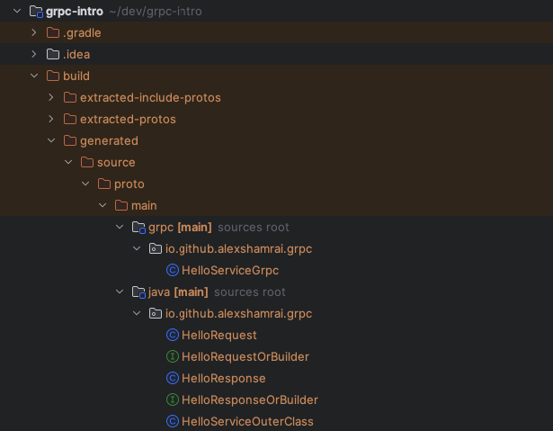
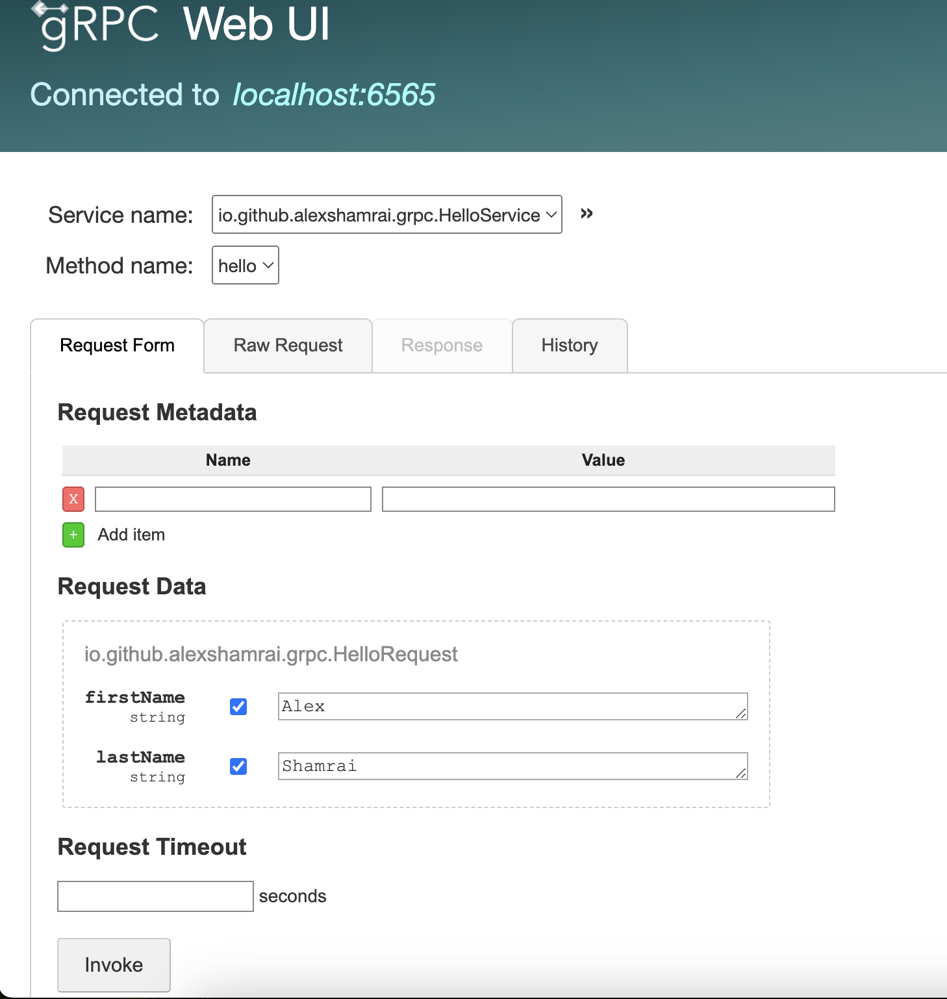
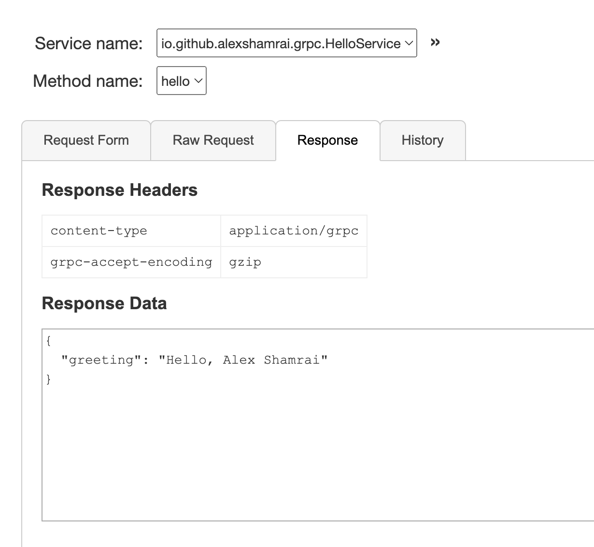

# gRPC Testing intro part 1

As Test Engineers, we often work with REST services while handling general projects.
However, I recently encountered the need to interact with a gRPC service. In this article, we’ll create a sample gRPC 
service using Java and explore the simplest ways to test it effectively.

### What is gRPC?

[gRPC](https://grpc.io/) is a high-performance, open-source Remote Procedure Call (RPC) framework initially developed by
Google. It is designed to streamline service-to-service communication, enabling seamless connectivity between polyglot 
services across distributed data centers, plus reducing boilerplate code.

Unlike traditional HTTP REST APIs, gRPC uses [Protocol Buffers](https://protobuf.dev/) (Protobuf) as its interface
definition language (IDL) for defining service contracts. This approach enables faster serialization and deserialization,
making gRPC an efficient solution for modern, high-performance systems.

The core concept of gRPC is that you are actually calling a function implemented on a server.

### Why Testing gRPC is Different

Unlike REST, where data is sent in human-readable JSON over HTTP, gRPC transmits data in a binary format using
**Protocol Buffers ([Protobuf](https://protobuf.dev/))**. This efficient serialization method poses obstacles for debugging and testing. For instance:
- **Binary Data Transmission**: You can’t inspect requests and responses directly in a browser console, dedicated tools are needed.
- **Communication Patterns**: Beyond unary calls (one request, one response), gRPC supports several complex interaction models:

#### Communication Patterns in gRPC
1. **Unary RPC**: Unary RPC is the simplest gRPC communication model, where the client sends a single request and receives
a single response. The interaction process includes the following steps: invocation, metadata exchange, processing and response, completion
2. **Server Streaming RPC**: The client sends a single request and receives a stream of responses. Clients can decide to
process all responses or stop at a particular condition, such as a timeout or a specific response field.
3. **Client Streaming RPC**: The client sends a stream of requests to the server, which processes them and sends back a single response.
4. **Bidirectional Streaming RPC**: Both client and server exchange independent streams of messages concurrently,
allowing real-time parallel processing.

### Creating a sample Hello World service
Let’s build a simple "Hello World" service to understand gRPC with a practical yet straightforward example.
We’ll use Java with Gradle as our build tool to create this sample application. So create a new Gradle project and 
follow the steps below.

#### 1. Add required dependencies
Now update the `build.gradle` file and add gRPC-related dependencies we’ll need for our project to work on.
```
runtimeOnly 'io.grpc:grpc-netty:1.69.0'  
implementation 'io.grpc:grpc-protobuf:1.69.0'  
implementation 'io.grpc:grpc-stub:1.69.0'
```
- **`grpc-netty`**: Enables gRPC to use Netty as its HTTP/2 transport layer, which is essential for the service runtime.
- **`grpc-protobuf`**: Adds support for Protocol Buffers, the serialization mechanism gRPC uses to define and exchange structured data.
- **`grpc-stub`**: Provides client and server stubs, generated from `.proto` files, to simplify the implementation of gRPC calls.
- **`protobuf-java-util`**: Offers utilities for working with Protocol Buffers, such as converting between Protobuf objects and JSON.
- **`javax.annotation-api`**: Supplies standard annotations (e.g., `@Nullable`, `@Generated`) commonly used during code generation and validation at compile time.

Also, [protobuf](https://plugins.gradle.org/plugin/com.google.protobuf) plugin is needed for integration with protocol buffers
```
id 'com.google.protobuf' version '0.9.4'
```

Customize sources directories:
```
sourceSets {  
    src {  
        main {  
            java {  
                srcDirs 'build/generated/source/proto/main/grpc'  
                srcDirs 'build/generated/source/proto/main/java'  
            }  
        }    
    }
}
```
Customize protobuf compilations:
```
protobuf {  
    protoc {  
        artifact = 'com.google.protobuf:protoc:4.29.1'  
    }  
  
    plugins {  
        grpc {  
            artifact = "io.grpc:protoc-gen-grpc-java:1.69.0"  
        }  
    }    
    generateProtoTasks {  
        all()*.plugins {  
            grpc {}  
        }    
    }
}
```

The resulting build.gradle file will look like:
```
plugins {  
    id 'java'  
    id 'com.google.protobuf' version '0.9.4'  
}  
  
group = 'io.github.alexshamrai'  
version = '1.0-SNAPSHOT'  
  
repositories {  
    mavenCentral()  
}  
  
sourceSets {  
    src {  
        main {  
            java {  
                srcDirs 'build/generated/source/proto/main/grpc'  
                srcDirs 'build/generated/source/proto/main/java'  
            }  
        }    
    }
}  
  
  
dependencies {  
    runtimeOnly 'io.grpc:grpc-netty:1.69.0'  
    implementation 'io.grpc:grpc-protobuf:1.69.0'  
    implementation 'io.grpc:grpc-stub:1.69.0'  
    implementation 'com.google.protobuf:protobuf-java-util:4.29.1'  
    compileOnly 'javax.annotation:javax.annotation-api:1.3.2'  
  
    testImplementation platform('org.junit:junit-bom:5.10.0')  
    testImplementation 'org.junit.jupiter:junit-jupiter'  
}  
  
protobuf {  
    protoc {  
        artifact = 'com.google.protobuf:protoc:4.29.1'  
    }  
  
    plugins {  
        grpc {  
            artifact = "io.grpc:protoc-gen-grpc-java:1.69.0"  
        }  
    }    
    generateProtoTasks {  
        all()*.plugins {  
            grpc {}  
        }    
    }
}  
  
test {  
    useJUnitPlatform()  
}
```
Now we are ready to start implementing our service
#### 2. Define a service in a .proto file
Create `HelloService.proto` file in `src/main/proto`
```
syntax = "proto3";  
option java_multiple_files = true;  
package io.github.alexshamrai.grpc;  
  
message HelloRequest {  
  string firstName = 1;  
  string lastName = 2;  
}  
  
message HelloResponse {  
  string greeting = 1;  
}  
  
service HelloService {  
  rpc hello(HelloRequest) returns (HelloResponse);  
}
```
* The first line tells the version of the syntax this file uses. 
* The second line forces to generate the code in individual files. By default, the compiler generates all the Java code
in a single Java file.
* The third line specifies the package we want to use for our generated Java classes.

Request payload is defined in `HelloRequest`. Each attribute that goes into the message is defined, along with its type.
A unique number needs to be assigned to each attribute, called the tag. **The protocol buffer uses this tag to represent
the attribute, instead of using the attribute name.**

So unlike JSON, where we’d pass the attribute name _firstName_ every single time, the protocol buffer will use the
number 1 to represent _firstName_. The response payload definition is similar to the request.

Service contract for our `HelloService`, will be defined in _hello()_ operation:
```
service HelloService {
    rpc hello(HelloRequest) returns (HelloResponse);
}
```
The`hello()`operation accepts a unary request and returns a unary response.

#### 3. Generate server and client code 
Now it is possible to run `generateProto` task to create java code. But since we are using plugin, code generation is
already implemented in our build cycle, so we just run the following command to build the project:
```
$ ./gradlew build
```

Then, you will see the auto generated code under **build/generated/source/proto** directory.


The following key files will be generated:
- _HelloRequest.java_ 
- _HelloResponse.java_
- _HelloServiceGrpc.java_

#### 4. Create the server application, implementing the generated service interfaces 

The **default implementation of the abstract class _HelloServiceImplBase_ is to throw the runtime exception** 
_io.grpc.StatusRuntimeException_,which says that the method is unimplemented.

Let's fix it by extending this class, and override the `hello()` method mentioned in our service definition:
```  
public class HelloServiceImpl extends HelloServiceGrpc.HelloServiceImplBase {  
  
    @Override  
    public void hello(  
        HelloRequest request, StreamObserver<HelloResponse> responseObserver) {  
  
        String greeting = "Hello, "  
                          + request.getFirstName()  
                          + " "  
                          + request.getLastName();  
  
        HelloResponse response = HelloResponse.newBuilder()  
            .setGreeting(greeting)  
            .build();  
  
        responseObserver.onNext(response);  
        responseObserver.onCompleted();  
    }  
}
```
gRPC's `hello()` method, defined in the `.proto` file, doesn't directly _return_ a `HelloResponse`.
Instead, it uses a `StreamObserver<HelloResponse>` as a second argument. This `StreamObserver` acts as a callback
mechanism for the server to send responses back to the client.  This way **the client gets the option to make a blocking
call or a non-blocking call**.

This `StreamObserver` approach provides flexibility for how the client handles responses:
- **Blocking (Synchronous):** The client waits for all responses to arrive before proceeding.
- **Non-Blocking (Asynchronous):** The client continues its work and is notified as each response arrives.

To create a `HelloResponse`, gRPC uses a builder pattern: `HelloResponse.newBuilder()`. You set the desired fields
(like the greeting text) and then call `.build()` to create the final object. This object is then sent to the client via
the `StreamObserver`'s `onNext()` method.

Finally, the server must call `onCompleted()` on the `StreamObserver` after sending all responses. This signals the end
of the communication; otherwise, the client would wait for more data.

Next, we’ll need to run the gRPC server and listen for incoming requests.
Create a gRPC server on port 8080, and add the _HelloServiceImpl_ service that we defined. _start()_ will start the server.
In our example, we’ll call _awaitTermination()_ to keep the server running in the foreground, blocking the prompt.
```
public class HelloServer {

    public static void main(String[] args) throws IOException, InterruptedException {
        Server server = ServerBuilder
            .forPort(6565)
            .addService(new HelloServiceImpl()).build();

        server.start();
        server.awaitTermination();
    }
}
```

### How to check the server manually
In order to be able to check our service manually we need to use [Reflection](https://grpc.io/docs/guides/reflection/). 
Reflection in gRPC lets clients discover a service's structure at runtime without needing the `.proto` file. This is useful for:
- **Dynamic clients:** Building generic clients that can work with any service supporting reflection.
- **Dev/test tools:** Easily creating tools to test and debug gRPC services (e.g., displaying available methods and parameters).
- **Service discovery:** Automatically finding available services and their interfaces in dynamic environments.

A gRPC server with reflection exposes a `ServerReflection` service. Clients query this service to get information about
available services, methods, and message types. This information is returned as a service descriptor, similar to a `.proto` file.
In short, reflection simplifies working with gRPC, especially in dynamic setups, by allowing clients to understand server
interfaces without prior knowledge.

To enable gRPC Reflection support add the following dependency to the `build.gradle`
```
implementation 'io.grpc:grpc-services:1.69.0'
```
And add `ProtoReflectionService` to the `HelloServer` 
```
public class HelloServer {  
  
    public static void main(String[] args) throws IOException, InterruptedException {  
        Server server = ServerBuilder  
            .forPort(6565)  
            .addService(new HelloServiceImpl())  
            .addService(ProtoReflectionServiceV1.newInstance())  
            .build();  
  
        server.start();  
        server.awaitTermination();  
    }  
}
```

Now we can use gRPCurl, Postman, grpcUI or any other testing tool for checking
##### gRPCurl

The easiest way to check the server from command line will be [gRPCurl](https://github.com/fullstorydev/grpcurl)
`grpcurl`is a command-line tool that lets you interact with gRPC servers. It's basically`curl`for gRPC servers.
Before interacting with `HelloServer`, do not forget to run `main` method, to run the server on localhost.
To see all services exposed by a server, use the `list` command:
```
grpcurl -plaintext localhost:6565 list
```
And you should see the following response
```
grpc.reflection.v1.ServerReflection
io.github.alexshamrai.grpc.HelloService
```

In our case, for testing `hello` method we need to run
```
grpcurl -plaintext -d '{"firstName": "Alex", "lastName": "Shamrai"}' localhost:6565 io.github.alexshamrai.grpc.HelloService/hello
```
And should see a response:
```
{
  "greeting": "Hello, Alex Shamrai"
}
```
##### gRPC UI
Another option is [gRPC UI](https://github.com/fullstorydev/grpcui)- an extension for gRPCurl. `grpcui`provides a web/browser-based GUI. This lets you interactively construct requests to send to a gRPC server.

To access to your server from browser, run the following command:
```
grpcui -plaintext localhost:6565
```
If everything is configured correctly, you'll see the following response:
```
gRPC Web UI available at http://127.0.0.1:53162/
```
And browser will open the UI


Fill `firstName` and `secondName` with appropriate data and click "Invoke" button
Appropriate response will be shown in "Response" tab
```
{
  "greeting": "Hello, Alex Shamrai"
}
```


### Creating Hello World client
Now we are sure that our server is working as expected, and can create a client in our code 
**gRPC provides a channel construct that abstracts out the underlying details,**like connection, connection pooling,
load balancing, etc.
We’ll create a channel using _ManagedChannelBuilder_. Here we’ll specify the server address and port.

We’ll use plain text without any encryption:
```
public class HelloClient {  
  
    public static void main(String[] args) {  
        ManagedChannel channel = ManagedChannelBuilder.forAddress("localhost", 6565)  
            .usePlaintext()  
            .build();  
  
        HelloServiceGrpc.HelloServiceBlockingStub stub  
            = HelloServiceGrpc.newBlockingStub(channel);  
  
        HelloResponse helloResponse = stub.hello(HelloRequest.newBuilder()  
            .setFirstName("Alex")  
            .setLastName("Shamrai")  
            .build());  
  
        System.out.println(helloResponse.getGreeting());  
  
        channel.shutdown();  
    }  
}
```

Then we’ll need to create a stub, which we’ll use to make the actual remote call to _hello()_.
**The stub is the primary way for clients to interact with the server.** When using auto-generated stubs, the stub class
will have constructors for wrapping the channel.

Here we’re using a blocking/synchronous stub so that the RPC call waits for the server to respond, and will either return
a response or raise an exception. There are two other types of stubs provided by gRPC that facilitate
non-blocking/asynchronous calls.

Now it’s time to make the _hello()_ RPC call. We’ll pass the _HelloRequest_. We can use the auto-generated setters to
set the _firstName_ and _lastName_ attributes of the _HelloRequest_ object.

Finally, the server returns the_HelloResponse_object.

Now we can run `main` method in `HelloServer`, and running `main` method in `HelloClient` afterward will show us the 
following message in console.
```
Hello, Alex Shamrai
```

### Summary

Implementing elementary service will help you to get some practical skills in order to understand how gRPC works and how
can you test it as an engineer.

All code snippets you can find in my sample project on [GitHub](https://github.com/alexshamrai/grpc-intro).